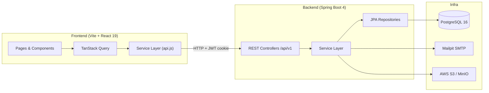

# Employee Resource Manager

> A full-stack HR platform for managing employees, projects, teams, tasks, timesheets, attendance, and meetings.

[](https://react.dev)
[](https://vitejs.dev)
[](https://spring.io/projects/spring-boot)
[](https://www.postgresql.org)
[](https://tanstack.com/query)

---

## Features

| Domain | Status |
|---|---|
| Authentication (JWT cookie + refresh) | ✅ |
| Employee management (CRUD) | ✅ |
| Team management (CRUD + membership) | ✅ |
| Project management (CRUD + membership) | ✅ |
| Task management (CRUD + comments + progress) | ✅ |
| Timesheets (log + approve / reject) | 🔧 Backend in progress |
| Attendance (clock-in / clock-out) | 🔧 Backend in progress |
| Meetings (schedule + attendees) | 🔧 Backend in progress |
| Admin alerts & approvals | ✅ |
| Role-based routing (Admin / Team Lead / Employee) | ✅ |

---

## Architecture



---

## Quick Start

### Option A — Docker Compose (recommended)

```bash
# Clone
git clone https://github.com/ritesh-prajan/Employee-Resource-Manager.git
cd Employee-Resource-Manager

# Start everything (Postgres + Mailpit + Backend + Frontend)
docker compose up
```

| Service | URL |
|---|---|
| Frontend | http://localhost:5173 |
| Backend API | http://localhost:8080/api/v1 |
| Mailpit (email UI) | http://localhost:8025 |

### Option B — Run manually

**Prerequisites:** Node 20+, Java 17+, PostgreSQL 16

```bash
# 1. Start Postgres and create the database
createdb employeemanager

# 2. Start backend
cd employeemanager-elite
./gradlew bootRun

# 3. Start frontend (in a new terminal)
cd ..
npm install
npm run dev
```

> The Vite dev server proxies `/api` → `http://localhost:8080` automatically.

---

## Project Structure

```
Employee-Resource-Manager/
├── src/                          # React frontend
│   ├── components/               # Shared UI components + ErrorBoundary
│   ├── context/                  # AuthContext, AppContext (global state)
│   ├── hooks/                    # TanStack Query hooks (useEmployees, …)
│   ├── pages/                    # admin/, employee/, lead/ pages
│   ├── services/                 # API service layer (api.js + domain services)
│   └── tests/                    # Vitest + MSW unit tests
├── employeemanager-elite/        # Spring Boot backend
│   └── src/main/java/com/elite/employeemanager/
│       ├── auth/                 # JWT authentication
│       ├── employee/             # Employee CRUD
│       ├── team/                 # Team + membership
│       ├── project/              # Project + membership
│       ├── task/                 # Task + comments + progress
│       ├── timesheet/            # Time log entries 🆕
│       ├── attendance/           # Clock-in / clock-out 🆕
│       └── meeting/              # Meeting scheduling 🆕
├── API_CONTRACT.md               # Full REST API documentation
├── docker-compose.yml            # One-command dev environment
└── vitest.config.js              # Test configuration
```

---

## API Documentation

See [`API_CONTRACT.md`](./API_CONTRACT.md) for the full REST API reference including:
- Auth flow (login, refresh, logout, password reset)
- All endpoint shapes, status enums, and error envelope format
- Planned endpoints for Timesheets, Attendance, and Meetings

---

## Testing

```bash
# Run all tests
npm run test

# Run with coverage report
npm run test:coverage
```

Tests use **Vitest** + **MSW** (Mock Service Worker) to intercept `fetch` at the network level, exercising the real service layer without hitting the backend.

---

## Environment Variables

| Variable | Description | Default |
|---|---|---|
| `SPRING_DATASOURCE_URL` | PostgreSQL JDBC URL | `jdbc:postgresql://localhost:5432/employeemanager` |
| `SPRING_DATASOURCE_USERNAME` | DB user | `erm_user` |
| `SPRING_DATASOURCE_PASSWORD` | DB password | `erm_pass` |
| `JWT_SECRET` | JWT signing secret (≥ 32 chars) | — |
| `JWT_EXPIRATION_MS` | Access token TTL (ms) | `900000` (15 min) |
| `JWT_REFRESH_EXPIRATION_MS` | Refresh token TTL (ms) | `604800000` (7 days) |
| `AWS_ACCESS_KEY_ID` | S3 access key | — |
| `AWS_SECRET_ACCESS_KEY` | S3 secret key | — |
| `AWS_S3_BUCKET` | S3 bucket name | — |

---

## Contributing

1. Fork the repository
2. Create a feature branch: `git checkout -b feat/my-feature`
3. Commit your changes: `git commit -m "feat: add my feature"`
4. Push to the branch: `git push origin feat/my-feature`
5. Open a Pull Request

---

## License

MIT © Ritesh Prajan
