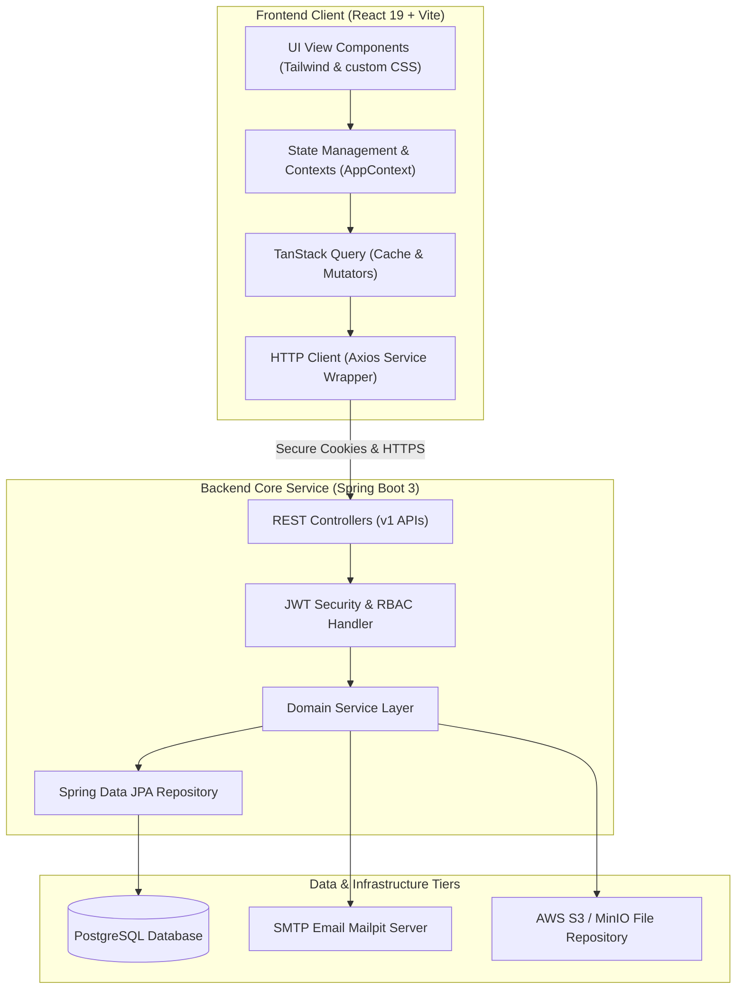

# 💼 Employee Resource Manager (ERM)

> **Empowering Enterprise Workforce Efficiency** – A high-performance, modern, and beautiful full-stack human capital and project resource management platform. Built on a container-first architecture using **React 19 + Vite**, **Spring Boot 3 (Java 21)**, **PostgreSQL 16**, and **TanStack Query 5**.

<p align="center">
  
  
  
  
  
</p>

---

## 📸 Interface Previews & Walkthroughs

Below are visual layouts describing the key workspaces of the application. 

### 1. Unified Employee Workspace
This page provides employees with active tasks tracking, time logging actions, and a live metrics display.
```
┌────────────────────────────────────────────────────────────────────────┐
│  💼 ERM Platform                  [🔔 Alerts (2)] [🙋 John Doe (Emp)]  │
├────────────────────────────────────────────────────────────────────────┤
│  🧭 Dashboard    📊 KPIs Scorecard:                                    │
│  📋 Tasks        ┌──────────────────┐┌──────────────────┐┌───────────┐ │
│  ⏱️ Timesheets   │  CLOCKED IN      ││  COMPLETED TASKS ││ EFFICIENCY│ │
│  📅 Meetings     │  04:15h (Today)  ││  12 / 15         ││ 92%       │ │
│                  └──────────────────┘└──────────────────┘└───────────┘ │
│                  📝 Active Tasks:                                      │
│                  ┌───────────────────────────────────────────────────┐ │
│                  │ [TSK-008] Implement JWT Token Security Check      │ │
│                  │ Project: Horizon Platform · Priority: Critical    │ │
│                  │ Progress: [██████░░░░] 60%  Logged: 4.5h / 8h      │ │
│                  │ [⏸️ Pause] [⏱️ Log Time] [✔️ Submit for Review]     │ │
│                  └───────────────────────────────────────────────────┘ │
└────────────────────────────────────────────────────────────────────────┘
```

### 2. Administrator & Team Lead Approvals Center
Allows administrators and managers to audit team resource utilization, authorize ETA extensions, and verify completed logs.
```
┌────────────────────────────────────────────────────────────────────────┐
│  💼 ERM Platform                       [🔔 Alerts (5)] [👑 Admin (Lead)]│
├────────────────────────────────────────────────────────────────────────┤
│  🧭 Dashboard    📥 Pending Approvals Audit Log:                       │
│  👥 Employees    ┌───────────────────────────────────────────────────┐ │
│  📁 Projects     │ 👤 Employee: Jane Doe (Senior Engineer)           │ │
│  🛡️ Approvals    │ 📋 Task: [TSK-006] Bug Fix Implementation         │ │
│                  │ ⚠️ Reason: ETA Extension (Requested: 2026-07-05)    │ │
│                  │ [✔️ Approve Extension]  [❌ Reject Extension]     │ │
│                  └───────────────────────────────────────────────────┘ │
│                  ┌───────────────────────────────────────────────────┐ │
│                  │ ⏱️ Timesheet Submission: John Smith (Junior Dev)   │ │
│                  │ 📂 Project: Horizon  ·  Category: Support (1.5 hrs)│ │
│                  │ [✔️ Approve Entry]  [❌ Reject Entry]             │ │
│                  └───────────────────────────────────────────────────┘ │
└────────────────────────────────────────────────────────────────────────┘
```

---

## ⚡ Main Modules & Feature Matrix

The platform provides role-based access control (RBAC) across three primary authorization tiers: **Admin**, **Team Lead / Sub Lead**, and **Employee**.

| Capability | Module Description | Status | Tiers |
| :--- | :--- | :---: | :---: |
| **Secure Authentication** | Stateless JWT authentication with secure httpOnly cookie-based refresh cycle. | 🔐 Active | All |
| **Org Structure Management** | Complete CRUD operations for Employees, Teams, and departmental mappings. | 👥 Active | Admin |
| **Project Tracking** | Project provisioning, owner/lead assignment, budget/color coding, and member allocation. | 📁 Active | Admin, Leads |
| **Task Lifecycle (Sprint)** | Stage, assign, transfer, and review tasks with real-time ETA extension requests. | 📋 Active | All |
| **Interactive Timesheets** | Log daily hours, categorize work (Story, Bug, Meeting, Break), and manage ETA warnings. | ⏱️ Active | All |
| **Attendance & KPIs** | Live clock-in/out dashboard tracking daily hours, metrics, and KPI scorecards. | 📊 Active | All |
| **Meeting Scheduler** | Schedule team meetings, map attendees, and link meeting logs directly to timesheets. | 📅 Active | All |
| **Admin Alerts & Approvals** | Unified approval center for manager reviews, task handoffs, and ETA extensions. | 🔔 Active | Admin, Leads |

---

## ⚙️ Core System Workflows

### 1. Task Lifecycle & Execution
The life of a task transitions through states dynamically managed by the backend database triggers and service layer:

```text
[OPEN] (Backlog / Unassigned)
   │
   ▼  (Assigned to Employee)
[IN_PROGRESS] (Timer starts / Timesheets logged)
   │
   ├─► (Breaches Estimated Hours/Due Date) ──► [OVER_ETA] (Requires justification comment)
   │
   ▼  (Submitted by Employee)
[PENDING_REVIEW] (Read-only status locked for Employee)
   │
   ├──► [Approved by Lead] ──► [COMPLETED]
   │
   └──► [Rejected by Lead] ──► [REJECTED] ──► Reverts to [IN_PROGRESS]
```

### 2. The Automated ETA Warning System
To ensure projects stay within scope, the platform runs a real-time validation engine:
*   When a user attempts to **log a time entry** or **submit a task for review**:
    - The backend checks if the cumulative hours logged (`loggedHours`) exceed the task's estimate (`etaHours`).
    - The backend checks if the current date has surpassed the task's due date (`etaDate`).
*   If either condition is met, the UI displays a warning banner requiring the user to provide an **Over-ETA Justification** before the entry can be successfully saved.

---

## 📁 Database Schema Details

The backend utilizes PostgreSQL with strict constraints and foreign keys to ensure data integrity:

### 1. `tasks` Table
Stores details of sprint tasks.
*   `id` (PK, Serialized Identity)
*   `task_number` (Unique String, indexed)
*   `title` / `description` (Text)
*   `task_type` (Enum: `FEATURE`, `BUG`, `STORY`, `RND`, `SUPPORT`, `TASK`, etc.)
*   `priority` (Enum: `LOW`, `MEDIUM`, `HIGH`, `CRITICAL`)
*   `status` (Enum: `OPEN`, `IN_PROGRESS`, `PENDING_REVIEW`, `COMPLETED`, `OVER_ETA`, etc.)
*   `eta_hours` (Decimal estimate)
*   `logged_hours` (Decimal, automatically re-evaluated from timesheet logs)
*   `eta_date` / `original_eta_date` (Dates)
*   `assigned_to` (FK -> `employees.id`)
*   `project_id` (FK -> `projects.id`)

### 2. `timesheet_entries` Table
Records hour logs for tasks or company events.
*   `id` (PK, Serialized Identity)
*   `employee_id` (FK -> `employees.id`)
*   `task_id` (FK -> `tasks.id`, nullable for Meetings/Breaks)
*   `project_id` (FK -> `projects.id`, nullable for Breaks)
*   `work_date` (Date)
*   `start_time` / `end_time` (Timestamps)
*   `hours_spent` (Decimal)
*   `work_category` (Enum: `STORY`, `BUG`, `FEATURE`, `SUPPORT`, `MEETING`, `BREAK`)
*   `status` (Enum: `PENDING`, `APPROVED`, `REJECTED`)
*   `description` / `justification` (Text)

---

## 🏗️ System Architecture & Client-Server Sync

ERM utilizes a modern decoupled service-oriented architecture ensuring high scalability, data isolation, and smooth state updates:



---

## 🚀 Quick Start & Development Environment

### Method A: Single-Command Local Sandbox (Recommended)

ERM comes pre-configured with a multi-container Docker Compose file bootstrapping the UI, Spring Boot API, PostgreSQL instance, and a Mailpit SMTP inbox.

```bash
# 1. Clone the project files
git clone https://github.com/ritesh-prajan/Employee-Resource-Manager.git
cd Employee-Resource-Manager

# 2. Spin up the entire environment (builds image triggers and DB migrations)
docker compose up --build
```

Once ready, access the services at their target URLs:

*   **Employee Resource Dashboard (UI):** [http://localhost:5173](http://localhost:5173)
*   **Spring Backend REST Endpoint:** [http://localhost:8080/api/v1](http://localhost:8080/api/v1)
*   **Mailpit SMTP Web Portal:** [http://localhost:8025](http://localhost:8025)

---

### Method B: Manual Local Setup

If running without Docker, follow these steps:

#### Backend Infrastructure Setup
Ensure **Java 21 JDK** and **PostgreSQL 16** are active on your system.

```bash
# 1. Access the database console and provision the target DB
psql -U postgres -c "CREATE DATABASE employeemanager;"

# 2. Navigate to the backend directory and launch the Boot task
cd employeemanager-elite
./gradlew bootRun
```

#### Frontend Client Setup
Requires **Node.js 20+** environment.

```bash
# 1. Return to the root directory
cd ..

# 2. Install dependencies & launch Vite Development Server
npm install
npm run dev
```

---

## 📂 Codebase Directory Blueprint

```text
Employee-Resource-Manager/
├── src/                          # React frontend
│   ├── components/               # Shared UI components + ErrorBoundary
│   ├── context/                  # AuthContext, AppContext (global state)
│   ├── hooks/                    # TanStack Query hooks (useEmployees, …)
│   ├── pages/                    # admin/, employee/, lead/ pages
│   ├── services/                 # API service layer (api.js + domain services)
│   └── tests/                    # Vitest + MSW unit tests
├── employeemanager-elite/        # Spring Boot backend
│   └── src/main/java/com/elite/employeemanager/
│       ├── auth/                 # JWT authentication
│       ├── employee/             # Employee CRUD
│       ├── team/                 # Team + membership
│       ├── project/              # Project + membership
│       ├── task/                 # Task + comments + progress
│       ├── timesheet/            # Time log entries 🆕
│       ├── attendance/           # Clock-in / clock-out 🆕
│       └── meeting/              # Meeting scheduling 🆕
├── API_CONTRACT.md               # Full REST API documentation
├── docker-compose.yml            # One-command dev environment
└── vitest.config.js              # Test configuration
```

---

## 🔧 Environment Configurations

The application reads context variables dynamically. Override the defaults using a `.env` file in the root or set them directly in your shell environment:

| Property Name | Purpose | Production Default / Recommended |
| :--- | :--- | :--- |
| `SPRING_DATASOURCE_URL` | PostgreSQL JDBC connection URL. | `jdbc:postgresql://localhost:5432/employeemanager` |
| `SPRING_DATASOURCE_USERNAME` | Database username credentials. | `postgres` |
| `SPRING_DATASOURCE_PASSWORD` | Database password credentials. | `postgres` |
| `JWT_SECRET` | Cryptographic secret for signing tokens. | *Keep it minimum 256-bit hash* |
| `JWT_EXPIRATION_MS` | Access token time-to-live. | `900000` (15 Minutes) |
| `JWT_REFRESH_EXPIRATION_MS` | Refresh token time-to-live. | `604800000` (7 Days) |
| `AWS_ACCESS_KEY_ID` | Object storage provider access key ID. | *Your AWS / MinIO Access ID* |
| `AWS_SECRET_ACCESS_KEY` | Object storage provider secret key. | *Your AWS / MinIO Secret Key* |

---

## 🧪 Testing Strategy

The client features comprehensive unit and integration testing built using **Vitest** and **Mock Service Worker (MSW)**, ensuring network-level interception without real database hits:

```bash
# Execute local unit-tests
npm run test

# Launch and view code coverage results
npm run test:coverage
```

---

## 🤝 Contributing & Standards

1. Create a descriptive Feature Branch: `git checkout -b feature/cool-new-feature`.
2. Adhere to the established Linting & Prettier standard format.
3. Write matching unit tests inside the `src/tests` directory.
4. Ensure all test blocks pass successfully before opening a Pull Request (PR).

---

## 📝 License

This project is licensed under the **MIT License** - see the LICENSE file for details.

© 2026 **Ritesh Prajan** & Contributors. All rights reserved.
